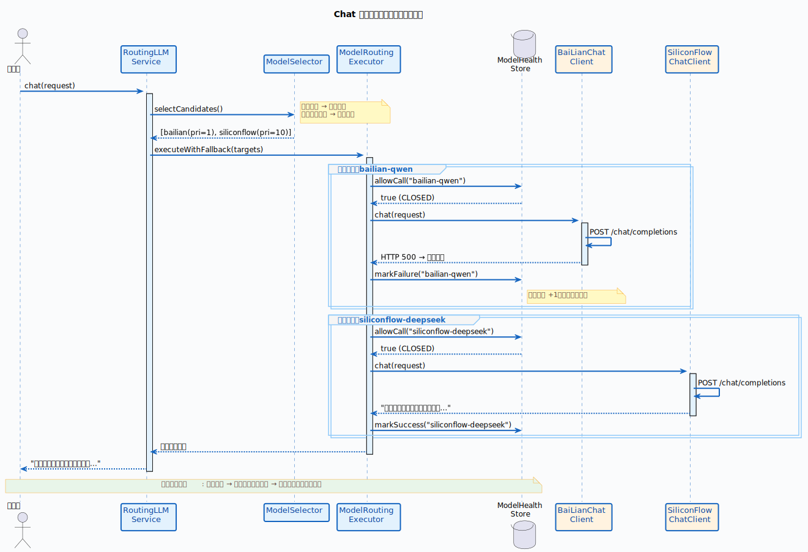

# Infra-ai

- 底层基础设施：config、enums、http、token、util
- 路由核心：model--提供模型选择、健康检查、故障转移
- 能力子系统：chat、embedding、rerank -- 三条并行业务线

## config

配置核心。

- `AIModelProperties`：将 YAML 配置绑定为类型安全的 Java 对象。

## enums

类型词汇表。

- `ModelProvider`：供应商枚举。
- `ModelCapability`：能力枚举。

## model

路由核心。

- `ModelSelector`：负责选择模型。
- `ModelHealthStore`：负责维护模型健康状态。
- `ModelRoutingExecutor`：负责执行模型路由调用。
- `ModelTarget`：表示调用目标。
- `ModelCaller`：函数式调用接口。

## http

HTTP 基础设施。

- `ModelUrlResolver`：URL 解析。
- `HttpResponseHelper`：响应工具。
- `ModelClientException`：统一客户端异常。
- `ModelClientErrorType`：错误分类。
- `HttpMediaTypes`：HTTP 媒体类型常量。

## chat

LLM 对话子系统。

- `LLMService`：对话业务接口。
- `ChatClient`：供应商客户端接口。
- `AbstractOpenAIStyleChatClient`：OpenAI 风格客户端模板基类。
- 三个供应商实现：负责具体模型提供方接入。
- `RoutingLLMService`：对话路由服务。
- 流式相关组件：负责流式输出链路。

## embedding

向量化子系统。

- `EmbeddingService`：向量化业务接口。
- `EmbeddingClient`：供应商客户端接口。
- 两个供应商实现：负责具体 embedding 能力接入。
- `RoutingEmbeddingService`：向量化路由服务。

## rerank

重排序子系统。

- `RerankService`：重排业务接口。
- `RerankClient`：供应商客户端接口。
- `BaiLianRerankClient`：百炼重排实现。
- `NoopRerankClient`：空对象实现。
- `RoutingRerankService`：重排路由服务。

## token

Token 估算。

- `TokenCounterService`：Token 统计接口。
- `HeuristicTokenCounterService`：启发式统计实现。

## util

# framework

- 横切基础设施层：承接 Web、数据库、缓存、消息队列、链路追踪、幂等控制等通用能力
- 设计目标：把“每个业务模块都会重复写一次”的工程代码收敛到统一模块，业务层只关注自身领域逻辑
- 依赖组合：Spring Web、MyBatis-Plus、Redis / Redisson、Sa-Token、RocketMQ、TTL

## config

自动装配入口。
- `DataBaseConfiguration`：注册 MyBatis-Plus 分页拦截器和自动填充处理器，统一持久层基础配置。
- `RocketMQAutoConfiguration`：装配事务消息监听器和消息生产者适配器，对上层暴露统一 MQ 发送接口。
- `WebAutoConfiguration`：注册全局异常处理器，让业务模块默认获得一致的 Web 异常响应行为。

## convention

通用约定模型。
- `Result`：统一接口返回体，约束 `code`、`message`、`data`、`requestId` 等字段。
- `ChatMessage`、`ChatRequest`：抽象对话请求和消息结构，作为问答链路中的基础协议对象。
- `RetrievedChunk`：抽象检索结果分片，为后续重排、组装上下文提供统一载体。

## context

运行时上下文能力。
- `LoginUser`：定义登录用户快照，承载用户 ID、用户名、角色、头像等信息。
- `UserContext`：基于 `TransmittableThreadLocal` 维护用户上下文，保证异步线程池场景下身份信息不丢失。
- `ApplicationContextHolder`：提供 Spring 容器静态访问能力，方便基础设施层按需获取 Bean。

## database

数据库基础增强。
- `MyMetaObjectHandler`：接管 MyBatis-Plus 自动填充逻辑，把创建时间、更新时间这类公共字段处理集中化。

## distributedid

分布式 ID 能力。
- `SnowflakeIdInitializer`：启动时通过 Redis + Lua 申请 `workerId` 和 `datacenterId`，完成 Snowflake 初始化。
- `CustomIdentifierGenerator`：对接 MyBatis-Plus 主键生成流程，让业务实体直接复用统一 ID 方案。
- 这一层的价值不是“生成 ID”本身，而是避免多实例部署时主键冲突和各模块各写一套 ID 逻辑。

## cache

缓存键规范。
- `RedisKeySerializer`：统一 Redis key 的序列化方式，避免不同模块使用 Redis 时出现键格式不一致的问题。

## errorcode

错误码约定。
- `IErrorCode`：定义错误码抽象接口。
- `BaseErrorCode`：沉淀通用错误码枚举，给异常体系和统一返回体提供标准化编码。

## exception

三层异常模型。
- `AbstractException`：统一业务异常基类，承载错误码和错误消息。
- `ClientException`：面向调用方输入、状态不合法等客户端错误。
- `ServiceException`：面向服务内部业务执行失败。
- `RemoteException`：面向远程调用或外部系统异常。
- `VectorCollectionAlreadyExistsException`：对知识库向量集合重复创建场景做语义化封装。

## idempotent

双场景幂等控制。
- `IdempotentSubmit` + `IdempotentSubmitAspect`：面向接口重复提交，基于 Redisson 分布式锁控制表单或命令型请求只执行一次。
- `IdempotentConsume` + `IdempotentConsumeAspect`：面向 MQ 重复消费，基于 Redis 状态位和 Lua 脚本实现消费中、已消费、异常回滚的状态流转。
- `SpELUtil`：支持通过注解表达式抽取业务键，避免幂等 key 构造硬编码。
- 这组组件说明 `framework` 不只是“工具箱”，而是在为分布式一致性问题提供可复用方案。

## mq

消息队列抽象。
- `MessageWrapper`：统一消息体包装格式，把业务载荷和消息 key 收口到一个对象里。
- `MessageQueueProducer`：定义统一消息发送接口，屏蔽具体 MQ 客户端细节。
- `RocketMQProducerAdapter`：落地普通消息和事务消息发送。
- `DelegatingTransactionListener`：把 RocketMQ 的事务回查机制抽象成按 topic 注册的检查器模型。
- `TransactionChecker`：给各业务模块预留事务回查扩展点。

## trace

RAG 链路追踪基础。
- `RagTraceContext`：维护 `traceId`、`taskId` 和节点栈，并通过 TTL 透传到异步执行链路。
- `RagTraceNode`、`RagTraceRoot`：为方法级链路打点提供注解语义，区分根节点和普通节点。
- 这部分是上层 RAG 编排、检索、生成可观测性的底座，不直接做业务，但决定后续排障和调优成本。

## web

Web 层统一出口。
- `GlobalExceptionHandler`：集中处理参数校验、认证鉴权、上传大小限制和兜底异常，统一返回 `Result`。
- `Results`：提供成功 / 失败结果的快捷构造方法，减少控制器层样板代码。
- `SseEmitterSender`：对 `SseEmitter` 做线程安全封装，统一流式输出、连接关闭和异常收口逻辑。

## 总结

`framework` 的定位不是直接承载 RAG 业务，而是给整个系统提供一层“工程基础设施底座”：
- 往上，`bootstrap` 等业务模块可以直接复用上下文、异常、幂等、MQ、Trace 等能力。
- 往下，它把 Redis、RocketMQ、MyBatis-Plus、Sa-Token 这些中间件细节隔离成稳定约定。
- 从工程视角看，`framework` 决定了这个项目是否具备统一规范、低重复开发成本和可运维性。

工具类。

- `LLMResponseCleaner`：清理大模型响应中的 Markdown 代码围栏。
